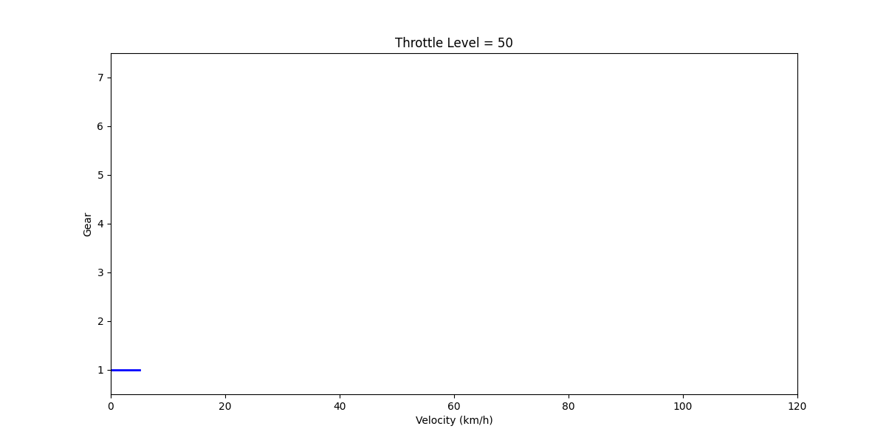

#### Fuzzy Logic-Based Algorithm for Gear Shift Timing in Automobiles

## Table of Contents
1. [Docs](#gear-shift-decision-maker-based-on-Fuzzy-logic-algorithm)
2. [Run Process](#run)

## Gear Shift decision maker based on Fuzzy logic algorithm

---

#### Inputs:
- Velocity (km/h)
- RPM (engine revolutions per minute)
- Throttle Level (car's accelerator pedal)

#### Output:
- Gear

---

#### Key concept making fuzzy rules:
1. When the car is driven as in normal/base mode by driver - it means lack of strong pressure on the accelerator pedal -> the car should stay on its current gear, unless:
    - RPM is high -> then gear should be shifted up to "sailing mode" on higher gear with less RPM
    - RPM is low ->  then car should also stay on the current gear to "sail"
2. When Throttle level is high it means, the driver wants to dynamicly accelerate, so the gear box should be shifted down, to put the engine into higher RPM, which means more power for the driver.

---

#### Linguistic variables:
- Velocity: very low, low, medium, high, (very high - current not implemented - useful when concerning higher velocity values > 140 km/h)
- RPM:      low, medium, high
- Throttle: low, medium, high

---

#### Defuzzyfication method: **defuzzifyWeightedAverage**
This function implements a **defuzzification** technique known as the **Weighted Average (or Center of Peaks)** method. It takes:

- `memberships`: a map of **fuzzy output labels (gear levels)** to their **membership values** (how strongly each gear is activated).
- `ranges`: a map from each label to a **triangular range** (`[start, peak, end]`), using the **peak** as a crisp representative value.

It computes the **weighted average** of the peaks of all output fuzzy sets, using the membership values as weights.

Pros:
- **Simple and Fast**: Easy to implement and computationally efficient.

Cons:
- **Ignores Shape of Membership Functions**: Only the peak values are used—this discards useful information about the full distribution.

---

#### Short introduction:
Current implementation is partially lack of precision espesially in low values of velocity. In the future should be consider to implement the idling gear, which should also appear when the car's velocity is 0, despite of whatever RPM and throttle level value is, because car is in idle mode (parking mode).
Moreover, the transitions from one to another gear should be smoother. This problem may occure due to defuzzyfication method which is currently used.

The tendecy line is good but beacuse of lack of expert knowlegde and therefore not perfect rules and also complexity in selection the right RPM in synchorization with right velocity to get as real-behavioured car acceleration as possible there are points in this animation where the gear is down shifting, which shouldn't occure in perfect car acceleration.

## Run
1. Checkout the lastest version
2. Go to test-visualization directory
3. Run the GearShift function with prefered parameters (exec file on repo is windows exec, so in case of need running app on linux, should be first generated linux exec)
